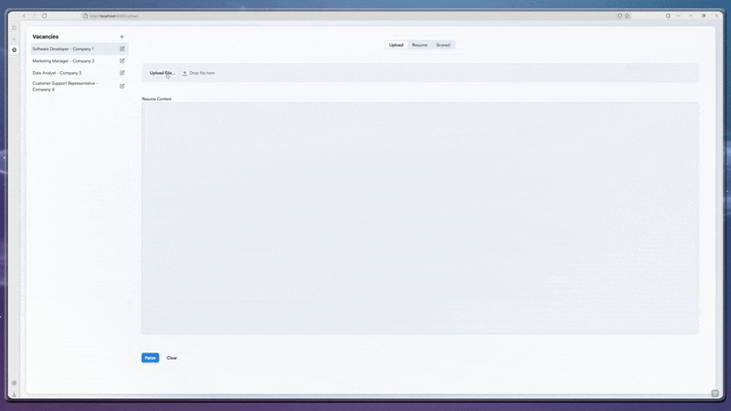

# Resume Sorting System

A tool for parsing, scoring, and ranking job applicants based on configurable recruiter-defined criteria. Built with modern Java technologies and AI-powered resume mapping.

<div align="center">
  
  <p><em>Interactive demo showing resume upload, scoring configuration, and candidate ranking</em></p>
</div>

## **Features**

### **Intelligent Resume Processing**

- Multi-format document support (PDF, DOC, DOCX)
- AI-powered content extraction and mapping
- Automated scoring based on time-equivalent methodology


### **Configurable Scoring System**

- Convert qualifications to common time units
- Recruiter-defined multipliers for job-specific weighting
- Real-time score recalculation


### **Modern Technology Stack**

- **Backend**: Java 21, Spring Boot 3.3.4, Spring AI (OpenAI integration)
- **Frontend**: Vaadin 24 with responsive design
- **Database**: PostgreSQL with JPA/Hibernate
- **Processing**: Apache Tika for document extraction


## **How Resume Scoring Works **

The system converts every section of a resume into a common unit: **time**. By translating each qualification into "days of effort," it creates an objective baseline to score and rank candidates fairly.

### **Scoring Formula**

**Final Category Score = "Time Equivalent (in Days)" × "Recruiter Multiplier"**

### **Time Equivalents**

| Resume Item | Time Equivalent (in Days) | Duration |
| :-- | :-- | :-- |
| Work Experience | Actual number of days worked | Actual time |
| Education: Doctorate | 1460 | 4 years |
| Education: Master's | 1095 | 3 years |
| Education: Bachelor's | 730 | 2 years |
| Project | 183 | 6 months |
| Volunteer Work | 183 | 6 months |
| Certification | 120 | 4 months |
| Language | 10 | 10 days |
| Skill | 1 | 1 day |


This system creates a balanced foundation where substantial work experience can significantly impact scores, while other qualifications provide consistent, measurable value regardless of their actual duration. However, every job has unique requirements, and the **recruiter multiplier system** allows you to adjust scoring priorities to match your specific needs.

Set multipliers from **0 to 10** for each category through the scoring configuration interface. Moving sliders instantly recalculates scores for all candidates, allowing you to see how your priorities affect rankings.

## **Quick Start**

### **Prerequisites**

- Java 21 or higher
- Docker and Docker Compose
- OpenAI API key


### **1. Clone and Setup**

```bash
git clone <your-repository-url>
cd resume-sorting-system
```


### **2. Configuration**

Create an `application.properties` file in `src/main/resources/`:

```properties
# Database Configuration
spring.datasource.url=jdbc:postgresql://localhost:5432/resume
spring.datasource.username=YOUR_DB_USERNAME_HERE
spring.datasource.password=YOUR_DB_PASSWORD_HERE

# OpenAI Configuration
spring.ai.openai.api-key=YOUR_OPENAI_API_KEY_HERE

# Server Configuration
server.port=8080
```

**Note**: For production deployments, use a `secret.properties` file (added to `.gitignore`) to hide sensitive credentials. Load it using `@PropertySource("classpath:secret.properties")` in your configuration class.

### **3. Database Setup**

Create `docker-compose.yml`:

```yaml
version: '3.8'
services:
  postgres:
    image: 'postgres:latest'
    environment:
      - 'POSTGRES_DB=resume'
      - 'POSTGRES_PASSWORD=YOUR_DB_PASSWORD_HERE'
      - 'POSTGRES_USER=YOUR_DB_USERNAME_HERE'
    ports:
      - '5432:5432'
    volumes:
      - postgres_data:/var/lib/postgresql/data

volumes:
  postgres_data:
```

Start the database:

```bash
docker-compose up -d
```


### **4. Run the Application**

```bash
# Build and run
mvn clean install
mvn spring-boot:run
```

Access the application at `http://localhost:8080`

## **Docker Deployment**

### **Complete Production Setup**

```yaml
version: '3.8'
services:
  postgres:
    image: 'postgres:latest'
    environment:
      - 'POSTGRES_DB=resume'
      - 'POSTGRES_PASSWORD=${DB_PASSWORD}'
      - 'POSTGRES_USER=${DB_USER}'
    ports:
      - '5432:5432'
    volumes:
      - postgres_data:/var/lib/postgresql/data
    networks:
      - resume-network

  app:
    build: .
    ports:
      - '8080:8080'
    environment:
      - SPRING_DATASOURCE_URL=jdbc:postgresql://postgres:5432/resume
      - SPRING_DATASOURCE_USERNAME=${DB_USER}
      - SPRING_DATASOURCE_PASSWORD=${DB_PASSWORD}
      - SPRING_AI_OPENAI_API_KEY=${OPENAI_API_KEY}
    depends_on:
      - postgres
    networks:
      - resume-network

volumes:
  postgres_data:

networks:
  resume-network:
    driver: bridge
```

Create `.env` file:

```env
DB_USER=YOUR_DB_USERNAME_HERE
DB_PASSWORD=YOUR_DB_PASSWORD_HERE
OPENAI_API_KEY=YOUR_OPENAI_API_KEY_HERE
```

Deploy:

```bash
docker-compose up --build
```


## **Database Schema**

The application automatically creates comprehensive database schema including:

- Resume and candidate management tables
- Job vacancy tracking
- Scoring system configuration
- Document storage and metadata
- Relationship mappings for all resume components


## **AI Integration**

Integrates with OpenAI's GPT-4o-mini model for intelligent resume parsing and content extraction. Ensure your API key has sufficient credits and appropriate rate limits for your expected usage volume.

## **Future Enhancements**

- Authentication and authorization system
- Bulk resume processing capabilities
- Advanced analytics and reporting dashboard
- Machine learning model improvements
- REST API for programmatic access

---

*This project is in active development. Feedback and contributions are welcome as we work towards a production-ready release.*

<div style="text-align: center">⁂</div>

